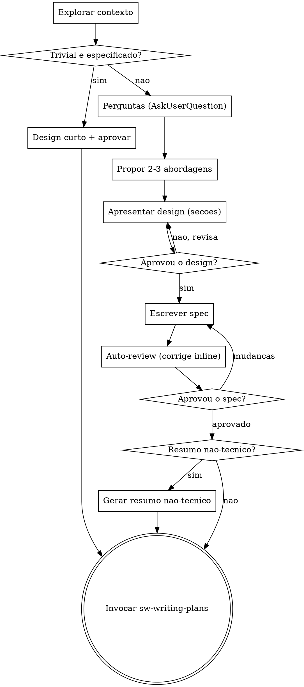

# Brainstorming — da ideia ao design

Transformar ideias em designs e specs bem formados através de diálogo colaborativo.

Comece entendendo o contexto atual do projeto; depois faça perguntas — uma de cada vez —
pra refinar a ideia. Quando entender o que vai construir, apresente o design e obtenha
aprovação antes de qualquer implementação.

<HARD-GATE>
NÃO invoque skill de implementação, NÃO escreva código, NÃO faça scaffold nem qualquer
ação de implementação até apresentar um design e o usuário aprovar. Vale para TODO projeto.
</HARD-GATE>

## Escale o processo ao tamanho do trabalho

O gate (aprovar antes de implementar) é **sempre** obrigatório — o que **escala** é a
profundidade:

- **Trivial e já especificado** (mudança pequena e óbvia): apresente um design de **1-2
  frases** e peça aprovação via `AskUserQuestion` (**Aprovar / Ajustar**). Sem perguntas
  longas, sem arquivo de spec. Aprovou → segue.
- **Substancial / novo / ambíguo**: rode o **fluxo completo** abaixo.
- **Na dúvida, trate como substancial.** "Simples demais pra precisar de design" é
  justamente onde suposições não-checadas geram mais retrabalho.

## Regra: toda decisão é via AskUserQuestion

Toda pergunta/decisão ao usuário usa a tool `AskUserQuestion` (menu clicável) — nunca texto
solto, e **nunca termine um turno com pergunta em texto**. Vale para: clarificações (uma por
chamada), **escolha de abordagem** (passo 3), **aprovação de cada seção do design** (passo 4),
**gate de revisão do spec** (passo 7) e a **oferta do resumo não-técnico** (passo 8). Para
respostas abertas, ofereça as opções prováveis e use o campo **"Other"**. Exceção: o usuário
descrevendo livremente a ideia/um ajuste é ele dirigindo — não force menu aí.

## Checklist

Crie uma task para cada item e cumpra na ordem (no caminho completo):

1. **Explorar o contexto** — arquivos, docs, commits recentes.
2. **Perguntas de clarificação** — uma por vez, via `AskUserQuestion`; entender propósito,
   restrições e critério de sucesso.
3. **Propor 2-3 abordagens** — com trade-offs e sua recomendação; a escolha é um `AskUserQuestion`.
4. **Apresentar o design** — em seções escaladas à complexidade; aprovação de cada via `AskUserQuestion`.
5. **Escrever o spec** — em `~/.claude/projects/<cwd-slug>/specs/YYYY-MM-DD-<topic>-design.md`. NÃO commitar.
6. **Auto-review do spec** — placeholders, contradições, escopo, ambiguidade (corrigir inline).
7. **Usuário revisa o spec** — via `AskUserQuestion` (**Aprovar / Pedir mudanças**).
8. **Oferecer resumo não-técnico** — via `AskUserQuestion` (Sim/Não); se sim, gerar (ver seção).
9. **Transição** — invocar a `sw-writing-plans` (se disponível) pra criar o plano de implementação.

## Fluxo

**Estado terminal: invocar a `sw-writing-plans`.** Não invoque nenhuma outra skill de
implementação — só a `sw-writing-plans` vem depois do brainstorming.

## O processo

**Entender a ideia:**

- Veja o estado atual do projeto primeiro (arquivos, docs, commits).
- Antes de detalhar, avalie o escopo: se o pedido descreve vários subsistemas independentes
  ("plataforma com chat, storage, billing e analytics"), sinalize na hora — não gaste
  perguntas refinando algo que precisa ser decomposto antes.
- Se o projeto é grande demais pra um spec só, ajude a **decompor em sub-projetos** (peças
  independentes, como se relacionam, em que ordem). Cada sub-projeto tem seu próprio ciclo
  spec → plano → implementação.
- Para escopo adequado, pergunte **uma coisa de cada vez** (via `AskUserQuestion`).
- Foque em: propósito, restrições, critério de sucesso.

**Explorar abordagens:**

- Proponha 2-3 abordagens com trade-offs; lidere com a recomendada e explique o porquê.
- A escolha final é um `AskUserQuestion` (as abordagens como opções + "Other").

**Apresentar o design:**

- Apresente em seções escaladas à complexidade (poucas frases se simples, até 200-300
  palavras se sutil).
- Pergunte (menu) a cada seção se está certo antes de seguir.
- Cubra: arquitetura, componentes, fluxo de dados, tratamento de erro, testes.

**Design para isolamento e clareza:**

- Quebre o sistema em unidades pequenas, cada uma com **um** propósito claro, comunicando-se
  por interfaces bem definidas e testáveis isoladamente.
- Para cada unidade: o que faz, como se usa, do que depende. Dá pra entender sem ler as
  entranhas? Dá pra mudar o interno sem quebrar quem consome? Se não, as fronteiras precisam
  de trabalho. Arquivo que cresce demais costuma ser sinal de que faz coisa demais.

**Em bases de código existentes:**

- Explore a estrutura antes de propor mudanças; siga os padrões existentes.
- Inclua melhorias **pontuais** onde o código atual atrapalha o trabalho (arquivo grande
  demais, fronteiras confusas) — sem refactor não relacionado.

## Depois do design

**Documentação (spec):**

- Escreva o spec validado em `~/.claude/projects/<cwd-slug>/specs/YYYY-MM-DD-<topic>-design.md`.
  - **Slug dinâmico**: derive do diretório atual com `pwd | sed 's|/|-|g'`. Ex.: cwd
    `/var/www/challenge` → slug `-var-www-challenge`. Nunca use nome fixo.
  - `mkdir -p` se o diretório não existir. (Preferência do usuário sobre o local sobrescreve este default.)
- **Não commitar** automaticamente — deixe o arquivo pro usuário commitar quando quiser.

**Auto-review do spec:** com olhos frescos —
1. **Placeholders:** "TBD"/"TODO"/seções incompletas/requisitos vagos → corrija.
2. **Consistência interna:** seções se contradizem? a arquitetura bate com as features?
3. **Escopo:** cabe num único plano, ou precisa decompor?
4. **Ambiguidade:** algum requisito tem duas leituras? escolha uma e deixe explícito.

Corrija inline. Para specs grandes, opcionalmente despache um **subagent revisor** usando o
template `spec-document-reviewer-prompt.md`.

**Gate de revisão do usuário:** peça via `AskUserQuestion` (**Aprovar / Pedir mudanças**) que
o usuário revise o spec escrito antes de prosseguir. Se pedir mudanças, ajuste e repita o
auto-review. Só siga com a aprovação.

**Implementação:** invoque a `sw-writing-plans` (se disponível) pra criar o plano detalhado.
É o próximo passo — não invoque outra skill.

## Resumo não-técnico (para apresentar a pessoas de negócio)

Depois do spec aprovado, **ofereça via `AskUserQuestion`** (Sim / Não):
*"Quer que eu gere um resumo não-técnico desse desenvolvimento, pra apresentar a pessoas
não-técnicas (cliente, gestor, stakeholder)?"*

Se **sim**, conduza as escolhas — **todas via `AskUserQuestion`** — nesta ordem:

**a) Campos (analise o spec primeiro).** Leia o spec e proponha os campos que fazem sentido
pra ESTE projeto — não uma lista fixa. A **base entra sempre**: *O que é · Problema que
resolve · O que muda na prática · Principais entregas*. Ofereça os **extras** como opções
selecionáveis (multiSelect), sugerindo os mais relevantes ao spec:
- **Fases / prazo em alto nível**
- **Benefício em número** (métrica de impacto: menos chamados, checkout mais rápido…)
- **Público-alvo / persona**
- **Fora de escopo** (o que NÃO entra agora — alinha expectativa)
- **Custo / prazo simplificado** (esforço em alto nível: pequeno/médio/grande ou faixa)

**b) Formato** (multiSelect — pode mais de um):
- **Markdown** — `...-resumo.md` ao lado do spec.
- **One-pager HTML** — página única estilizada (bonita, pra mostrar/enviar/imprimir).
- **Slides** — markdown de slides (Marp) pra reunião.
- **PDF** — gerado a partir do HTML (headless Chromium / print-to-PDF). Se não houver browser
  disponível, entregue o HTML e avise.

**c) Logomarca** (Sim / Não): *"Tem uma logomarca pra incluir?"*. Se **sim**, peça o
**caminho da imagem**, **embuta** no resultado (base64 no HTML/PDF pra ficar self-contained) e
posicione no topo; grave a referência certinho. Se **não**, siga sem logo.

**Conteúdo e regras:**
- **Tom neutro explicativo** (padrão): claro e honesto, sem vender.
- **Zero jargão** (nada de "endpoint", "schema", "deploy", "API"); analogia quando ajudar.
- **Curto** — cabe numa página; escaneável.
- Foco em **valor**, não em implementação. O **spec técnico continua a fonte da verdade** —
  o resumo é complemento.
- Salve tudo ao lado do spec, mesmo nome-base por formato:
  `~/.claude/projects/<cwd-slug>/specs/YYYY-MM-DD-<topic>-resumo.{md,html,pdf}`.

## Princípios

- **Uma pergunta por vez** — não sobrecarregue.
- **Menu (`AskUserQuestion`) sempre** — mais fácil de responder; nunca pergunta em texto solto.
- **YAGNI sem dó** — corte feature desnecessária de todo design.
- **Explore alternativas** — sempre 2-3 abordagens antes de decidir.
- **Validação incremental** — apresente, aprove, então avance.
- **Seja flexível** — volte e esclareça quando algo não fecha.
