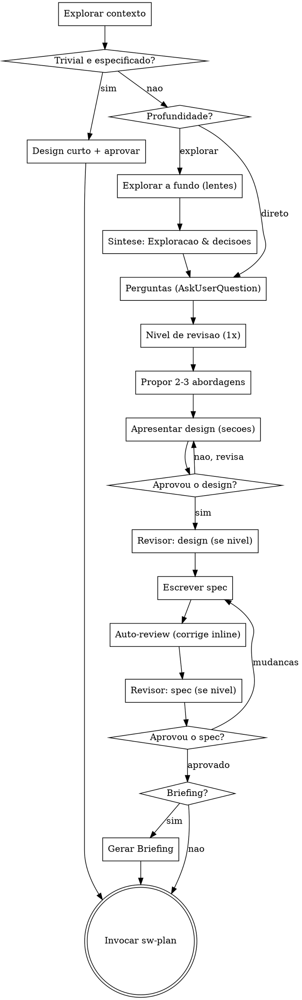

# Brainstorming — da ideia ao design

Transformar ideias em designs e specs bem formados através de diálogo colaborativo.

Comece entendendo o contexto atual do projeto; depois faça perguntas — uma de cada vez —
pra refinar a ideia. Quando entender o que vai construir, apresente o design e obtenha
aprovação antes de qualquer implementação.

<HARD-GATE>
NÃO invoque skill de implementação, NÃO escreva código, NÃO faça scaffold nem qualquer
ação de implementação até apresentar um design e o usuário aprovar. Vale para TODO projeto.
</HARD-GATE>

## Escale o processo ao tamanho do trabalho

O gate (aprovar antes de implementar) é **sempre** obrigatório — o que **escala** é a
profundidade:

- **Trivial e já especificado** (mudança pequena e óbvia): apresente um design de **1-2
  frases** e peça aprovação via `AskUserQuestion` (**Aprovar / Ajustar**). Sem perguntas
  longas, sem arquivo de spec. Aprovou → segue.
- **Substancial / novo / ambíguo**: rode o **fluxo completo** abaixo.
- **Na dúvida, trate como substancial.** "Simples demais pra precisar de design" é
  justamente onde suposições não-checadas geram mais retrabalho.

## Regra: toda decisão é via AskUserQuestion

Toda pergunta/decisão ao usuário usa a tool `AskUserQuestion` (menu clicável) — nunca texto
solto, e **nunca termine um turno com pergunta em texto**. Vale para: **profundidade** (passo 2,
Direto/Explorar a fundo), clarificações (uma por chamada), **as lentes de exploração** (uma por
chamada, quando ativo), **nível de revisão** (passo 3), **escolha de abordagem** (passo 4),
**aprovação de cada seção do design** (passo 5), **gate de revisão do spec** (passo 8) e a
**oferta do Briefing** (passo 9). Para
respostas abertas, ofereça as opções prováveis e use o campo **"Other"**. Exceção: o usuário
descrevendo livremente a ideia/um ajuste é ele dirigindo — não force menu aí.

## Checklist

Crie uma task para cada item e cumpra na ordem (no caminho completo):

1. **Explorar o contexto** — arquivos, docs, commits recentes.
2. **Profundidade + perguntas** — logo após o contexto, pergunte via `AskUserQuestion`:
   **Direto** (segue direto pras clarificações) ou **Explorar a fundo** (roda o loop de lentes
   divergentes — ver "Modo exploração"). Nos dois casos, as perguntas são **uma por vez** e
   miram propósito, restrições e critério de sucesso.
3. **Perguntar o nível de revisão** — uma vez, via `AskUserQuestion`; governa a sessão (ver
   seção "Revisor opcional"). Só no fluxo completo.
4. **Propor 2-3 abordagens** — com trade-offs e sua recomendação; a escolha é um `AskUserQuestion`.
5. **Apresentar o design** — em seções escaladas à complexidade; aprovação de cada via
   `AskUserQuestion`. Se o nível pedir, **revisor no design completo** (e, no modo "cada
   checkpoint", após cada gate).
6. **Escrever o spec** — em `docs/specs/YYYY-MM-DD-<topic>-design.md` **no projeto** (default). NÃO commitar.
7. **Auto-review do spec** — placeholders, contradições, escopo, ambiguidade (corrigir inline).
   Se o nível incluir spec, **revisor subagent do spec**.
8. **Usuário revisa o spec** — via `AskUserQuestion` (**Aprovar / Pedir mudanças**).
9. **Oferecer Briefing** — via `AskUserQuestion` (Sim/Não); se sim, gerar (ver seção).
10. **Transição** — invocar a `sw-plan` (se disponível) pra criar o plano de implementação.

## Fluxo

```dot
digraph brainstorming {
    "Explorar contexto" [shape=box];
    "Trivial e especificado?" [shape=diamond];
    "Design curto + aprovar" [shape=box];
    "Profundidade?" [shape=diamond];
    "Explorar a fundo (lentes)" [shape=box];
    "Sintese: Exploracao & decisoes" [shape=box];
    "Perguntas (AskUserQuestion)" [shape=box];
    "Nivel de revisao (1x)" [shape=box];
    "Revisor: design (se nivel)" [shape=box];
    "Revisor: spec (se nivel)" [shape=box];
    "Propor 2-3 abordagens" [shape=box];
    "Apresentar design (secoes)" [shape=box];
    "Aprovou o design?" [shape=diamond];
    "Escrever spec" [shape=box];
    "Auto-review (corrige inline)" [shape=box];
    "Aprovou o spec?" [shape=diamond];
    "Briefing?" [shape=diamond];
    "Gerar Briefing" [shape=box];
    "Invocar sw-plan" [shape=doublecircle];

    "Explorar contexto" -> "Trivial e especificado?";
    "Trivial e especificado?" -> "Design curto + aprovar" [label="sim"];
    "Trivial e especificado?" -> "Profundidade?" [label="nao"];
    "Design curto + aprovar" -> "Invocar sw-plan";
    "Profundidade?" -> "Perguntas (AskUserQuestion)" [label="direto"];
    "Profundidade?" -> "Explorar a fundo (lentes)" [label="explorar"];
    "Explorar a fundo (lentes)" -> "Sintese: Exploracao & decisoes";
    "Sintese: Exploracao & decisoes" -> "Perguntas (AskUserQuestion)";
    "Perguntas (AskUserQuestion)" -> "Nivel de revisao (1x)";
    "Nivel de revisao (1x)" -> "Propor 2-3 abordagens";
    "Propor 2-3 abordagens" -> "Apresentar design (secoes)";
    "Apresentar design (secoes)" -> "Aprovou o design?";
    "Aprovou o design?" -> "Apresentar design (secoes)" [label="nao, revisa"];
    "Aprovou o design?" -> "Revisor: design (se nivel)" [label="sim"];
    "Revisor: design (se nivel)" -> "Escrever spec";
    "Escrever spec" -> "Auto-review (corrige inline)";
    "Auto-review (corrige inline)" -> "Revisor: spec (se nivel)";
    "Revisor: spec (se nivel)" -> "Aprovou o spec?";
    "Aprovou o spec?" -> "Escrever spec" [label="mudancas"];
    "Aprovou o spec?" -> "Briefing?" [label="aprovado"];
    "Briefing?" -> "Gerar Briefing" [label="sim"];
    "Briefing?" -> "Invocar sw-plan" [label="nao"];
    "Gerar Briefing" -> "Invocar sw-plan";
}
```

**Estado terminal: invocar a `sw-plan`.** Não invoque nenhuma outra skill de
implementação — só a `sw-plan` vem depois do brainstorming.

## Modo exploração ("Explorar a fundo")

Escolhido no **passo 2**, logo após o contexto, via `AskUserQuestion` (**Direto** / **Explorar
a fundo**). Só no fluxo completo — no caminho trivial não aparece. **"Direto" é o padrão e não
muda nada**; **"Explorar a fundo"** roda um **loop divergente** antes de convergir pro design —
pra quando a ideia ainda está crua e vale abrir o espaço de possibilidades.

**Como funciona:** a skill conduz **2-3 lentes** de ideação (técnicas nomeadas — JTBD, divergir,
desafiar suposições, flip de restrições, referências, riscos), escolhendo as que a ideia pede.
Cada lente é um mini-bloco de perguntas **uma por vez** (`AskUserQuestion`, sempre com **"Other"**
e **"Pular esta lente"**). A cada ~2 lentes, oferece **convergir** ("Explorar mais uma lente" vs
"Já dá — sintetiza") — o loop **nunca é infinito nem obrigatório** até o fim.

Ao convergir, produz o bloco **"Exploração & decisões"** (problema enquadrado · ângulos
levantados · suposições confirmadas/derrubadas · direção escolhida), que:
- **alimenta as 2-3 abordagens** (passo 4), agora bem fundamentadas;
- vira a seção **`## Exploração & decisões`** do spec;
- entra também no **Briefing** (em linguagem de negócio), se o usuário pedir.

**O catálogo completo das lentes** (exemplos de pergunta + quando usar cada) está em
[`references/exploration-lenses.md`](references/exploration-lenses.md) — **leia antes de rodar o loop**.

**Guarda-corpos:** escolha poucas lentes (não as seis); **não repita** o que já foi respondido; a
saída "converge agora" está sempre disponível; sem arquivo novo (a síntese mora no spec).

## Revisor opcional (escalonável)

No **início do fluxo completo** (passo 3, logo após as clarificações), pergunte **uma vez** via
`AskUserQuestion` o nível de revisão por subagent. A resposta **governa a sessão toda** — não
re-pergunte a cada gate. Ofereça os quatro níveis:

- **Sem revisor** *(padrão)* — só o auto-review de olhos frescos que você já faz no spec.
- **Só no spec** — depois de escrever e auto-revisar o spec, despache um subagent revisor antes
  do gate do usuário.
- **Design + spec** *(recomendado)* — revisor no **design completo** (depois de aprovado, antes
  de escrever o spec) e de novo no **spec**.
- **Em cada checkpoint** — revisor após **cada gate** (abordagem escolhida, cada seção do design,
  spec). Mais minucioso, porém mais lento e caro — **avise isso ao usuário** na própria opção.

**Como despachar:** Task tool (`general-purpose`), com o template em
`spec-document-reviewer-prompt.md` (variante **"design/checkpoint"** ou **"spec"**). Sempre passe
ao revisor o **material acumulado até ali** — no modo "cada checkpoint", inclua o design inteiro
até a seção atual, nunca só o trecho isolado (review sem contexto não vale a pena).

**O revisor é consultivo — não substitui o gate do usuário, e nunca implementa nada.** Quando
ele voltar:
- **Sem problemas sérios** → siga; registre "revisor: ok" no resumo do checkpoint.
- **Com problemas** → corrija o que fizer sentido (ou explique por que não vale), e **só então**
  apresente o gate de aprovação ao usuário, listando o que o revisor apontou.

Vale só no **fluxo completo**. No caminho trivial (design de 1-2 frases) não há revisor.

## Feature visual? Sugira as skills de design (arsenal)

**Você analisa** se o que está sendo desenhado tem peso **visual/UI** (uma tela, um componente,
um fluxo de interface). Se tiver, o *look & feel* não é trabalho do brainstorming — sugira, via
`AskUserQuestion`, encaminhar a **direção visual** para as skills de design **se instaladas**:

- **`sw-design-studio`** — decide a direção visual (paleta, tipografia, motion, anti-genérico).
- **`sw-frontend-component-kit`** — se a feature precisa da **base de componentes** (Button,
  Input, Modal, Table…), gerar o kit seguindo os tokens do projeto.
- **`sw-frontend-mockup-preview`** — ver um preview antes de aplicar.

Ordem natural: **direção (`sw-design-studio`) → kit (`sw-frontend-component-kit`) → preview
(`sw-frontend-mockup-preview`)**. Você escolhe quais sugerir conforme a feature pede — nem toda
UI precisa das três.

**Regra:** sempre que envolver design (direção OU kit), **ofereça também ver no preview**
(`sw-frontend-mockup-preview`) via `AskUserQuestion` — **visualizar antes de aplicar é o
padrão**, não um extra. Cada oferta é um menu (Sim/Não), nunca texto solto.

Se não estiverem instaladas, recomende `/plugin install <skill>@ai-marketplace`; se o usuário
não quiser, siga sem elas. É **sugestão**, não obrigação — e **não** levante isso pra feature
sem UI (ex.: um job, uma API interna).

## O processo

**Entender a ideia:**

- Veja o estado atual do projeto primeiro (arquivos, docs, commits).
- Antes de detalhar, avalie o escopo: se o pedido descreve vários subsistemas independentes
  ("plataforma com chat, storage, billing e analytics"), sinalize na hora — não gaste
  perguntas refinando algo que precisa ser decomposto antes.
- Se o projeto é grande demais pra um spec só, ajude a **decompor em sub-projetos** (peças
  independentes, como se relacionam, em que ordem). Cada sub-projeto tem seu próprio ciclo
  spec → plano → implementação.
- Para escopo adequado, pergunte **uma coisa de cada vez** (via `AskUserQuestion`).
- Foque em: propósito, restrições, critério de sucesso.

**Explorar abordagens:**

- Proponha 2-3 abordagens com trade-offs; lidere com a recomendada e explique o porquê.
- A escolha final é um `AskUserQuestion` (as abordagens como opções + "Other").

**Apresentar o design:**

- Apresente em seções escaladas à complexidade (poucas frases se simples, até 200-300
  palavras se sutil).
- Pergunte (menu) a cada seção se está certo antes de seguir.
- Cubra: arquitetura, componentes, fluxo de dados, tratamento de erro, testes.

**Design para isolamento e clareza:**

- Quebre o sistema em unidades pequenas, cada uma com **um** propósito claro, comunicando-se
  por interfaces bem definidas e testáveis isoladamente.
- Para cada unidade: o que faz, como se usa, do que depende. Dá pra entender sem ler as
  entranhas? Dá pra mudar o interno sem quebrar quem consome? Se não, as fronteiras precisam
  de trabalho. Arquivo que cresce demais costuma ser sinal de que faz coisa demais.

**Em bases de código existentes:**

- Explore a estrutura antes de propor mudanças; siga os padrões existentes.
- Inclua melhorias **pontuais** onde o código atual atrapalha o trabalho (arquivo grande
  demais, fronteiras confusas) — sem refactor não relacionado.

## Depois do design

**Documentação (spec):**

- Escreva o spec validado **no projeto**: `docs/specs/YYYY-MM-DD-<topic>-design.md` (default —
  fica versionável junto do código). `mkdir -p docs/specs` se não existir.
  - **Fallback:** se o cwd não for um projeto/repo (sem `.git`, sem manifesto tipo `package.json`/
    `composer.json`), salve em `~/.claude/projects/<cwd-slug>/specs/` (slug = `pwd | sed 's|/|-|g'`).
  - A **preferência do usuário** sobre o local sempre sobrescreve o default.
- Se o **modo exploração** ("Explorar a fundo") rodou, inclua a seção **`## Exploração &
  decisões`** no spec (problema enquadrado, alternativas consideradas, direção escolhida e o
  porquê) — é o registro do raciocínio por trás do design.
- **Não commitar** automaticamente — deixe o arquivo pro usuário commitar quando quiser.

**Auto-review do spec:** com olhos frescos —
1. **Placeholders:** "TBD"/"TODO"/seções incompletas/requisitos vagos → corrija.
2. **Consistência interna:** seções se contradizem? a arquitetura bate com as features?
3. **Escopo:** cabe num único plano, ou precisa decompor?
4. **Ambiguidade:** algum requisito tem duas leituras? escolha uma e deixe explícito.

Corrija inline. Se o **nível de revisão** (passo 3) incluir o spec ("Só no spec", "Design +
spec" ou "Em cada checkpoint"), despache o **subagent revisor** do spec usando a variante
"spec" do template `spec-document-reviewer-prompt.md` antes do gate do usuário (ver "Revisor
opcional"). Para specs grandes, vale despachar mesmo que o nível seja "Sem revisor".

**Gate de revisão do usuário:** peça via `AskUserQuestion` (**Aprovar / Pedir mudanças**) que
o usuário revise o spec escrito antes de prosseguir. Se pedir mudanças, ajuste e repita o
auto-review. Só siga com a aprovação.

**Implementação:** invoque a `sw-plan` (se disponível) pra criar o plano detalhado.
É o próximo passo — não invoque outra skill.

## Briefing (para apresentar a pessoas de negócio)

Depois do spec aprovado, **ofereça via `AskUserQuestion`** (Sim / Não):
*"Quer que eu gere um Briefing desse desenvolvimento, pra apresentar a pessoas
não-técnicas (cliente, gestor, stakeholder)?"*

Se **sim**, conduza as escolhas — **todas via `AskUserQuestion`** — nesta ordem:

**a) Campos (analise o spec primeiro).** Leia o spec e proponha os campos que fazem sentido
pra ESTE projeto — não uma lista fixa. A **base entra sempre**: *O que é · Problema que
resolve · O que muda na prática · Principais entregas*. Ofereça os **extras** como opções
selecionáveis (multiSelect), sugerindo os mais relevantes ao spec:
- **Fases / prazo em alto nível**
- **Benefício em número** (métrica de impacto: menos chamados, checkout mais rápido…)
- **Público-alvo / persona**
- **Fora de escopo** (o que NÃO entra agora — alinha expectativa)
- **Custo / prazo simplificado** (esforço em alto nível: pequeno/médio/grande ou faixa)
- **Por que foi assim** (decisões da exploração: alternativas consideradas + motivo da escolha,
  em linguagem de negócio) — sugira este campo **quando o modo exploração rodou**

**b) Formato** (multiSelect — pode mais de um):
- **Markdown** — `...-briefing.md` ao lado do spec.
- **One-pager HTML** — página única estilizada (bonita, pra mostrar/enviar/imprimir).
- **Slides** — markdown de slides (Marp) pra reunião.
- **PDF** — gerado a partir do HTML (headless Chromium / print-to-PDF). Se não houver browser
  disponível, entregue o HTML e avise.

**c) Logomarca** (Sim / Não): *"Tem uma logomarca pra incluir?"*. Se **sim**, peça o
**caminho da imagem**, **embuta** no resultado (base64 no HTML/PDF pra ficar self-contained) e
posicione no topo; grave a referência certinho. Se **não**, siga sem logo.

**Conteúdo e regras:**
- **Tom neutro explicativo** (padrão): claro e honesto, sem vender.
- **Zero jargão** (nada de "endpoint", "schema", "deploy", "API"); analogia quando ajudar.
- **Curto** — cabe numa página; escaneável.
- Foco em **valor**, não em implementação. O **spec técnico continua a fonte da verdade** —
  o Briefing é complemento.
- Salve tudo ao lado do spec, mesmo nome-base por formato:
  ao lado do spec — `docs/specs/YYYY-MM-DD-<topic>-briefing.{md,html,pdf}`.

## Princípios

- **Uma pergunta por vez** — não sobrecarregue.
- **Menu (`AskUserQuestion`) sempre** — mais fácil de responder; nunca pergunta em texto solto.
- **YAGNI sem dó** — corte feature desnecessária de todo design.
- **Explore alternativas** — sempre 2-3 abordagens antes de decidir.
- **Validação incremental** — apresente, aprove, então avance.
- **Seja flexível** — volte e esclareça quando algo não fecha.
